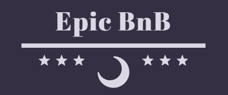

-

# Sito di annunci per la prenotazione di vacanze

✈Benvenuti su Epic BnB, il sito di annunci per la prenotazione di vacanze!✈

Qui troverete una vasta selezione di affascinanti location per tutti i gusti, che vi permetteranno di staccare dalla routine e vivere esperienze indimenticabili.

## Caratteristiche

**🔎Esplora una vasta selezione**: Naviga tra un'ampia varietà di destinazioni e tipologie di alloggi, dalle tranquille case rurali🏡 alle lussuose ville sul mare🌅. Scegli la destinazione perfetta per le tue prossime vacanze.

**📅Prenotazione semplice e veloce**: Il nostro sito ti permette di prenotare la tua vacanza in pochi e semplici passaggi. Basta indicare le date del soggiorno e il numero di ospiti, e potrai visualizzare tutte le opzioni disponibili.

**Esperienze personalizzate**: Cerca tra le diverse categorie e filtra gli annunci in base alle tue preferenze, come ad esempio piscina🏊, vista mare🏖 ,lago🏞, montagna🏔 e molto altro.

**✅Recensioni e valutazioni**: Leggi le recensioni degli altri ospiti e scopri le esperienze vissute presso le varie location. Potrai anche lasciare una tua recensione dopo il soggiorno, per aiutare altri viaggiatori nella scelta.

**🆘Assistenza clienti**: Il nostro team di supporto è sempre pronto ad aiutarti in caso di domande o necessità durante il processo di prenotazione o durante il soggiorno.

## Tecnologie utilizzate

Questo progetto frontend è stato sviluppato utilizzando React, una libreria JavaScript ampiamente utilizzata per la creazione di interfacce utente reattive e dinamiche. Abbiamo sfruttato Create React App per impostare rapidamente la struttura di base del progetto.Inoltre le funzionalità del sito sono state migliorate attraverso l' uso di Redux mentre la grafica è stata realizzata attraverso l' uso di React Bootstrap.

## Come iniziare👨‍💻

**Per avviare il progetto in ambiente di sviluppo, segui i passaggi seguenti:**

1.Assicurati di avere installato Node.js sul tuo computer.

2.Clona il repository da GitHub utilizzando il comando seguente:

**`git clone https://github.com/VittoriaBasile/progetto-finale-front-end.git`**

3.Entra nella cartella del progetto:

**cd progetto-finale-front-end**

4.Installa le dipendenze necessarie con npm:

**npm install**

5.Avvia l'app in modalità sviluppo:

**npm start**

6.Ora puoi aprire il tuo browser e visualizzare il sito all'indirizzo http://localhost:3000.
